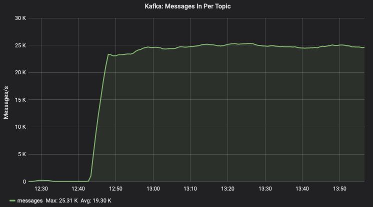

# viooh-mirror


_Rotating Kafka's head statue by David Cerny_


Viooh-Mirror an utility to mirror kafka topics across clusters along
with their schemas.


## Configuration
`viooh-mirror` uses 1config for configuration. For more information
see: [1config](https://github.com/BrunoBonacci/1config).

The application can be configured to run multiple `mirrors`. Each
`mirror` is a consumer loop that sends each record received from the
source topic to the destination topic. source and destination topics
can belong to different kafka clusters. When the avro serde is used
the schemas are automatically created in the destination cluster.

```clojure
{;; The configuration is designed around a number of groups A group
   ;; is contains the configuration for a number individual stream
   ;; mirrors. A mirror is a configuration which specifies a source
   ;; and a destination topic.  Mirrors that have in common the same
   ;; source and destination clusters can use groups to simplify the
   ;; configuration otherwise redundant. All the properties defined at
   ;; the group level will be merged in the individual mirror
   ;; definitions.
   ;;
   ;; The mirror's name and the consumer group will be automatically
   ;; generated using the :group-id-prefix. The consumer-group-id can
   ;; be overridden.
   ;;
   :groups
   [;; All the properties defined at the group level will be
    ;; available also at the single mirror configuration level
    {
     ;; This is prefixed on all mirror `:name`
     :group-id-prefix "prod"

     ;; This flag defines whether the whole group should be mirrored or not.
     ;; the default is `true`, if set to `false` the mirror for this topic
     ;; will NOT be started
     ;; :enabled true

     ;; the mirroring strategy used for the whole group. Currently we
     ;; support two modes `:strict` (default) and `:lenient`. The
     ;; Strict mode will attempt to have an exact copy of the subjects
     ;; across the two schema-registry, if this is not possible then it
     ;; will abort the mirroring. Lenient will try to ensure that all
     ;; the schemas which are present in the source subject are also
     ;; replicated in the destination cluster *in the same relative order*
     ;; however it will allow the destination to have additional schemas
     ;; which are not present in the source. Useful to merge a number
     ;; of similar topics into one or to use the destination as development
     ;; version of the source and thus allow to submit newer versions.
     ;; :mirror-mode :strict

     ;; The Consumer poll-interval, the maximum amount of time a consumer
     ;; will wait when no records are present before returning a empty batch.
     ;; :poll-interval 10000

     ;; the kafka and schema-registry information for the source
     ;; clusters (the ones you want to take the data from)
     :source
     {;; the kafka properties to use to connect the the source clusters
      :kafka {;; the comma-separated list of brokers to connect the consumer
              :bootstrap.servers "source:9092"
              ;; From which point you want to start consuming: "earliest"
              ;; or "latest", (default: earliest).
              :auto.offset.reset "earliest"
              ;; here you might want to add additional consumer properties
              ;; for example:
              :max.partition.fetch.bytes "1000000"
              :max.poll.records "50000"
              }
      ;; the url of the schema registry associated with the source kafka cluster
      :schema-registry-url "http://source-sr:8081"}

     ;; The information for the destination (where to copy the data).
     :destination
     {:kafka {;; the comma-separated list of brokers to connect the producer
              :bootstrap.servers "destination:9092"
              ;; here you might want to add additional producer properties
              }
      :schema-registry-url "http://destinaiton-sr:8081"}

     ;; Now in `:mirrors` you can list all the topics (source/dest) to mirror
     ;; from the above clusters. You can specify additional properties which
     ;; are specific only to a particular mirror or override previously defined
     ;; values (defined at group level).
     :mirrors
     [{;; the name of the particular mirror. If not defined it will be automatically
       ;; generated to be the name of the source and destination topics.
       ;;:name "<prefix>__<source-topic>__<dest-topic>"

       ;; This flag defines whether this mirror should be started or not.
       ;; the default is `true`, if set to `false` the mirror for this topic
       ;; will NOT be started
       ;; :enabled true

       ;; The group-id for the consumer. This will be used for checkpointing and load
       ;; and load-balancing. It is important that it is consistent over time.
       ;; IF CHANGED IT WILL CAUSE THE CONSUMER TO RESET TO THE EARLIEST (OR LATEST) RECORD.
       ;; if not provided it will be automatically generated as follow.
       ;; :consumer-group-id "<env>.viooh-mirror.<source-topic>__<dest-topic>"

       ;; in this case it will override the group-level configuration just
       ;; for this specific mirror.
       ;; :mirror-mode :lenient

       ;; which strategy to use for the subject naming `:topic-name` is the default
       ;; and the only supported option at the moment
       ;; :subject-naming-strategy :topic-name

       ;; The source topic to mirror
       :source      {:topic {:topic-name "source-topic"}}
       ;; The name of the topic to mirror to.
       :destination {:topic {:topic-name "mirror_test_copy_4"}
                     ;; force the subject compatibility level
                     ;; by default it will be mirrored from the source
                     ;; :force-subject-compatibility-level "NONE" }

       ;; the SerDes to use for the key and the value respectively
       :serdes [:string :avro]}]
     }

    ;; more groups can be added
    ]


   ;; This section controls what to do if topics on the destination side
   ;; do not exist. This could be used if the cluster has the auto-create
   ;; topics disabled.
   :topics-mirroring
   {;; whether or not the mirror should create the topics explicitly
    ;; on the destination cluster when the topic doesn't exists
    :auto-create-topics true

    ;; If the topic is create, which replication factor should be used
    ;; for a production environment we recommend to use at least 3.
    :replication-factor
    ;; Type can be either `:fix` or `:mirror-source`
    {:type :fix :value 3}
    ;; here an example of :mirror-source
    ;; {:type :mirror-source :min 3 :max 12}

    ;; The partition-count controls the number of partitions
    ;; for the new topic.
    :partition-count
    ;; Type can be either `:fix` or `:mirror-source`
    {:type :mirror-source :min 3 :max 12}}
   ;; here an example of :fix
   ;; {:type :fix :value 3}


   :metrics
   {;; type can be `:console` or `:prometheus`, or any if the TrackIt
    ;; supported reporters, or use `nil` to disable it
    ;; see Prometheus configuration here: https://github.com/samsara/trackit#prometheus
    ;;:type :console

    ;; Intentionally leaving out FileDescriptorRatioGauge as it does
    ;; not work with JDK12.See:
    ;; https://github.com/metrics-clojure/metrics-clojure/issues/133
    ;; and
    ;; https://github.com/metrics-clojure/metrics-clojure/pull/142.
    ;; Once the aboce issue is fixed, trackit needs to be released
    ;; with the upgraded metrics-clojure dependencies before we can
    ;; report this gauge again.
    :jvm-metrics [:memory :gc :threads :attributes]
    ;; how often the stats will be displayed
    :reporting-frequency-seconds 60}
   }
```

## Usage

```
# 1config key by default is `viooh-mirror`. This can be overridden using the env variable `ONE_CONF_KEY`.
# 1config env is picked from environment variable `ENV` (`local` by default)
$ lein run
```

## Monitoring

Metrics are pushed with the prefix `vioohmirror.**`. To see the number
of messages which are being polled by topic you can look for metrics
of the form
`vioohmirror.messages.poll.<group-id-prefix>_<mirror-name>.(count|1min_rate)`

To look for the number of messages which are being sent to the mirrored kafka look for metrics in the form
`vioohmirror.messages.send.<group-id-prefix>_<mirror-name>.inner.(count|1min_rate)` and for errors look for
`vioohmirror.messages.send.<group-id-prefix>_<mirror-name>.inner_errors.(count|1min_rate)`.

Circuit breakers are set around the source and destination schema-registry for the various operations.

## Load

One single `c5.large` instance can process ~25K msg/s (v0.7.1)




## How to release.

  - DEV
    - Every commit is pushed to DEV as build-number and `master`
  - UAT
     - Put a tag and push the Tag.
     - Build the tag from [Jenkins](https://jenkins.mgmt.develop.farm/job/VIOOH/job/viooh-mirror/view/tags/)
     - Every build pushes the container with the tag name and `stable`
  - PRD
     - Release and test in UAT first
     - Promote the artifact on [Jenkins](https://jenkins.mgmt.develop.farm/job/BigData/job/lab/view/Devops%20jobs/job/promote-artifact-to-prod/)
     - Every promotion pushes the container with the tag anme and `stable`
